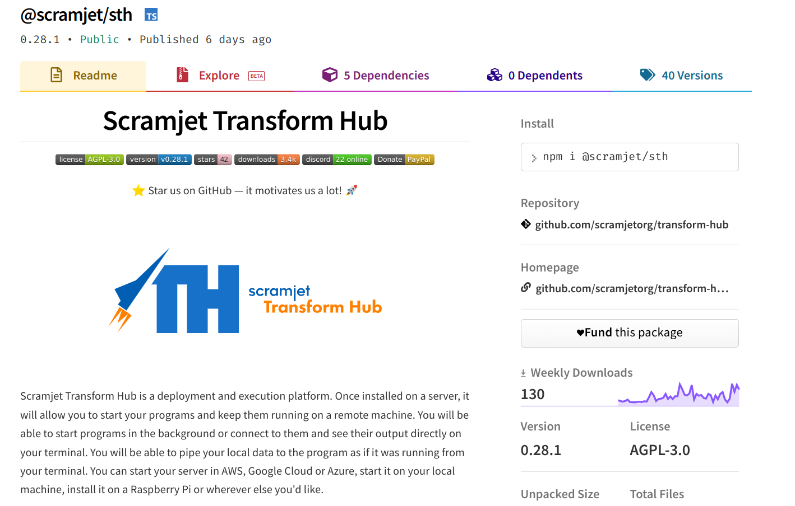
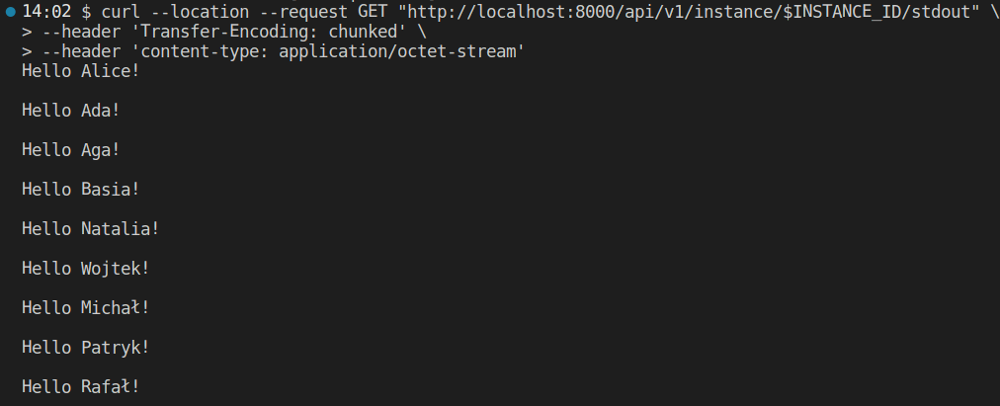

# Scramjet Transform Hub

<p align="center">
    <a></a>
    <a></a>
    <a></a>
    <a></a>
    <a href="https://www.paypal.com/cgi-bin/webscr?cmd=_s-xclick&hosted_button_id=7F7V65C43EBMW">
        
    </a>
</p>
<p align="center">⭐ Star us on GitHub — it motivates us a lot! 🚀 </p>
<p align="center">
    
</p>

# The Idea

Scramjet Transform Hub is a serverless system that allows you to easily deploy, run and interconnect programs that process repetitive data tasks in long-running processes. STH can be run just as well on a Raspberry Pi as it can on a massive 128 core Epyc bare metal server. It installs in one simple command and deploys your app to the cloud just as easily... Oh, and the app is incredibly simple too:

```js
export (input: Readable) => async function*() {
     for (const post of input) {
         if (!cache.has(post.id)) {
             yield await slack.note(`New post titled "${post.title}" from ${post.author}`);
         }
     }
}
```

It currently supports Node.js based apps, but Python and other languages are coming. Like that? [Get Scramjet Transform Hub straight from NPM](https://www.npmjs.com/package/@scramjet/sth)

---

# Table of contents

1. [Introduction](#introduction-handshake)
2. [Usage](#usage-bulb)
3. [Installation](#installation-clamp)
4. [The basics](#the-basics-abcd)
5. [Development instructions](#development-instructions-construction_worker)
    - [Install hub globally](#install-hub-globally-white_check_mark)
    - [Start the hub](#start-the-hub-checkered_flag)
    - [Install CLI and execute](#install-cli-and-execute-white_check_mark)
    - [Clean build](#clean-build-building_construction)
    - [Docker commands](#docker-commands-whale)
    - [Build Hub on Docker](#build-hub-on-docker-building_construction)
    - [Run Transform Hub in Docker](#run-transform-hub-in-docker-robot)
    - [Lerna commands](#lerna-commands-pencil)
6. [Sample usage](#sample-usage-sunglasses)
    - ["Hello Alice" sample](#hello-alice-sample-wave)
    - [More samples](#more-samples-books)
    - [Configure your own sample](#configure-your-own-sample-pencil)<!--section to be improved-->
7. [Troubleshooting](#troubleshooting-collision)
    <!--
    Section to be added:
    - Known issues and limitations
    -->
8. [License and contributions](#license-and-contributions-page_with_curl)
9. [Work with us](#help-wanted-information_desk_person)
10. [Donation](#donation-money_with_wings)

---

# Introduction :handshake:

This is a development repo for Scramjet Transform Hub, a container supervisor that allows deployment, execution and monitoring of any application based on a simple interface.

This repository contains the source code for <https://hub.scramjet.org>.

If you want to [read the usage docs, go here ☝🏼](https://github.com/scramjetorg/scramjet-cloud-docs)

What's more, this repository is intended for developers who would like to:

- participate in the Scramjet Transform Hub development community
- register feature requests, issues and PRs for this product
- build Transform Hub from source
- dive into code and see how it works

The developers who would like to simply use Scramjet Transform Hub to run data processing applications, we recommend following resources:

 [Repository with Introductory README and code samples](https://github.com/scramjetorg/scramjet-cloud-docs)

 [NPM page for main scramjet/sth package](https://www.npmjs.com/package/@scramjet/sth)

 [NPM page for scramjet/cli package](https://www.npmjs.com/package/@scramjet/cli)

---

# Usage :bulb:

Scramjet Transform Hub is a deployment and execution platform. Once installed on a server, it will allow you to start your programs and keep them running on a remote machine. You will be able to start programs in the background or connect to them and see their output directly on your terminal. You will be able to pipe your local data to the program as if it was running from your terminal. You can start your server in AWS, Google Cloud or Azure, start it on your local machine, install it on a Raspberry Pi or wherever else you'd like.

There's no limit to what you can use it for. Do you want a stock checker? A chatbot? Maybe you'd like to automate your home? Retrieve sensor data? Maybe you have a lot of data and want to transfer and wrangle it? You have a database of cities and you'd like to enrich your data? You do machine learning and you want to train your set while the data is fetched in real-time? Hey, you want to use it for something else and ask us if that's a good use? Ask us [via email](mailto:get@scramjet.org) 📧 or hop on our [Scramjet Slack](https://join.slack.com/t/scramjetframework/shared_invite/enQtODg2MDIyMTQ5MzUxLTVlNTIwMmFlYWU0YTg2ZTg1YmFiOTZkZTdhNzNmNjE2ZmQ3ZWQzZjI5MGQyZDAyOWM2NDc5YzdmZGQzNGI3YTU) 

[Check our proposition of sample architecture for use cases in different industries.](https://scramjet.org/#use-cases)

This is the STH development repo. In order to use it, you need to have linux based os, for instance [Ubuntu](https://ubuntu.com/download/server), [docker](https://www.docker.com/get-started) and [node.js v16.x](https://nodejs.org/en/) installed. We're working on development guides for Mac and Windows. 🔜

---

# Installation :clamp:

Our hub is based on node.js, so you need to install node.js and npm, which is the default package manager for node.js.
We will guide you step by step through the installation process.

There are several installations you need to perform to get the hub up and running, and even more to start developing with us. You may already have some of these below installed, but we will show you how to install them anyway.

- nvm
- node.js
- lerna
- yarn
- typescript
- ts-node
- docker

To check if you already have Node.js(v16.xx.x) and npm installed, please check the installed version, run the following commands in your console:

```bash
node -v
npm -v
```

If none of the above commands is found, please proceed with the installation.

It is recommended to use a Node version manager like [nvm](https://github.com/nvm-sh/nvm/blob/master/README.md) to install Node.js and npm. Do it by running the install script using the following cURL command presented below in your console. Make sure you replace v0.39.0 with the latest version of nvm. The actual version of nvm to install is [here](https://github.com/nvm-sh/nvm/blob/master/README.md#install--update-script)

```bash
curl -o- https://raw.githubusercontent.com/nvm-sh/nvm/v0.39.0/install.sh | bash
```

After executing the above command you should get in the console this info:


Which means that you need to run those two more commands to finish the installation:

```bash
export NVM_DIR="$HOME/.nvm"
[ -s "$NVM_DIR/nvm.sh" ] && \. "$NVM_DIR/nvm.sh"
[ -s "$NVM_DIR/bash_completion" ] && \. "$NVM_DIR/bash_completion"
```

Export lines from above will be saved in your ~/.bashrc file so that you will not need to run it every session start.
After that you can check nvm version just to confirm that you have successfully installed nvm.

command: `nvm --version`

output: `v0.37.2`


Now you are ready to install node.js, simply type in your console:

```bash
nvm install 16     # command will install latest LTS Version of Node.js
```

> :pencil: **Note**:
The project is working on Node Long Term Support (LTS) Version. Witch contains Node Package Manager (NPM) in `^8.1.0` version.
NodeJS in version `^17.XX.X` will install NPM in version `^8.1.2` and we don't use it right now 😉.

🤓 For more info you can check out the node.js official [webpage](https://nodejs.org).

Now you can check the installed version of node.js and npm, run the following command in your console:

command: `node -v`

output: `v16.13.0`

command: `npm -v`

output: `8.1.0`


OK! It looks like you have successfully installed node.js and npm. There are two more installations you need to perform, run the following commands in your console one after another:

```bash
npm install -g lerna
npm install -g yarn
```


The same as before the installations can be confirmed by checking the installed versions:


OK! The installation was successful. 🎉 🎆

We also work with Docker . Currently we are working on a solution where using Docker will be optional, but until then please continue with the installation procedure.
Run the following command in your console:

```bash
sudo apt install -y docker.io docker-compose
```

Verify that Docker and Docker-Compose are installed by getting their versions:

```bash
sudo docker version
docker-compose version
```

Now let's clone build and start the hub. Please copy the following commands to the terminal:

```bash
git clone https://github.com/scramjetorg/transform-hub.git && \
cd transform-hub && sudo gpasswd -a $USER docker && \
yarn install && yarn build:all && npm i -g ./dist/cli && yarn start -P 8000
```

Depending on your machine this may take some time, so it is a perfect time for another hot beverage ☕ or walk 🚶🏼‍♀️ or joggling 🤹‍♂️ or push-ups maybe..? no? Then simply wait 🧘 Meantime let me describe you what is happening in the command you have just pasted into the console:

- `git clone https://github.com/scramjetorg/transform-hub.git` is cloning the hub repository.
- `cd transform-hub` is changing the directory to the hub repository.
- `sudo gpasswd -a $USER docker` is adding the current user to the docker group.
- `yarn install` is installing all the dependencies of the hub.
- `yarn build:all` is building all the hub packages, this script includes three other building scripts (yarn build:packages && yarn build:refapps && yarn build:docker).
- `npm i -g ./dist/cli` is installing the hub CLI as a global command.
- `yarn start -P 8000` is starting the hub with parameter `-P`, which makes the hub listen on port 8000.

> :bulb: **NOTE:**  *If you skip parameter `-P` the hub will listen on port 8000 anyway, this port is set as a default value in the hub configuration file.*

 When it's done, the Hub should be running and you should see initial logs showing that the API server has been started on port 8000, something like this:

```bash
2021-07-07T18:19:36.808Z info (object:Host) API listening on port: localhost:8000
```

Hub is all set and ready to work with.


You can also install the hub using npm [@scramjet/sth](https://www.npmjs.com/package/@scramjet/sth) package:

```bash
npm i -g @scramjet/sth
```

and start the hub:

```bash
scramjet-transform-hub
```



---

# The basics :abcd:

Scramjet Transform Hub allows you to deploy and execute programs that you build and develop. As mentioned above, you can run any program you like, but you need to know a couple of important things:

* The program should consist of a function or an array of functions, such a program is called a **Transform Sequence**.
* The sequence will be executed within a separate docker instance (🔜 we're working on other execution environment integrations - help will be appreciated 🦾).
* The sequence function will receive a stream as input in the first argument - you can send the data to it via the command `si instance input`.
* If your sequence contains more than one function, then the output from the first function is passed to the next one. Also, the first function in sequence receives the input from API.
* The last (or the only) function in sequence can return a `Promise` or a `Stream` - based on this, STH will know when processing is done.
* Once the returned `Promise` is resolved, or the `Stream` is ended, STH will gracefully stop the sequence and remove its container.
* You can communicate with the server via API, command line client `si` which we wrote for your convenience.
* The sequence is called with an AppContext as `this`, a class that allows you to communicate back from the sequence: send logs, provide health info, send and receive events from the API or CLI.
* You can run your sequence multiple times with different arguments (like for instance currency tickers with different symbols or sensor data readers for each sensor)
* The program does not leave your server and doesn't use any external systems. It runs on the server you install the host on.
* Currently STH supports node.js runner only, we're working on bringing you runners for other languages, with Python and C++ as the first ones.

Some important links 👀:

* Here you can find the definition of the [Transform Sequence AppContext](./docs/types/interfaces/appcontext.md)
* You can see the [Scramjet Transform Hub API docs here](./docs/interfaces/API-reference.md)
* You can see the [CLI documentation here](./docs/development-guide/scramjet-interface-cli.md), but `si help` should also be quite effective.
* Don't forget to `star` this repo if you like it, `subscribe` to releases and keep visiting us for new versions and updates.
* You can [open an issue - file a bug report or a feature request here](https://github.com/scramjetorg/transform-hub/issues/new/choose)

---

# Development instructions :construction_worker:

In this section we will show you some useful commands, tools and functionalities that you can use to develop your own programs.

If you want to help out, we're happy to accept your pull requests. Please follow the below information to start development.

You should already have node.js, npm and other necessary packages installed, also transform-hub repo should be cloned by now. If not and you skipped the installation section, then please go back and follow the instructions, they are initial for development.

In [#Installation](#installation-:clamp:) section we managed to start the hub, which confirmed that the installation process was performed successfully. This is the command we used to start the hub: `yarn start -P 8000`. The `-P` option is used to start the hub on localhost and port number 8000 (127.0.0.1:8000). It is worth mentioning, that the hub can be started on any port number, and it can be started in several ways, which is described in the following sections.

## Install hub globally :white_check_mark:

After build is done, you can install and run hub globally:

```bash
npm install -g ./dist/hub  # installs packages globally
scramjet-transform-hub     # starts host
```

You can also install current Hub release from registry:

```bash
npm install -g @scramjet/hub
scramjet-transform-hub
```

## Start the hub :checkered_flag:

Hub can be started in multiple ways

```bash
yarn start                          # Starts Host after it's been built
node dist/host/bin/start            # This is the same as above
ts-node packages/host/src/bin/start # This starts node from source code
```

## Install CLI and execute :white_check_mark:

This command was already done at the end the [#Installation](#installation-:clamp:) section, just before starting the hub. There are two ways to install the CLI:

- in the root folder, after building, run the following commands:

```bash
npm i -g ./dist/cli # install CLI globally
si help             # show CLI commands
```

- you can also install the @scramjet/cli package from [npm](https://www.npmjs.com/package/@scramjet/cli).

```bash
npm i -g @scramjet/cli # install CLI globally
si help                # show CLI commands
```


Please run `si help` command to confirm that the installation went properly and also to see the list of available commands:


We will use CLI later on to execute the sequence. You can also [jump right away to CLI reference](https://github.com/scramjetorg/transform-hub/blob/release/0.12/docs/interfaces/API-reference.md).

> **:bulb: HINT:** If something goes wrong make clean, install, build.

## Clean build :building_construction:

This is how to perform a clean build of the packages:

```bash
yarn install:clean        # this command will perform yarn clean && yarn clean:modules && yarn install at once
yarn build:all-packages   # optionally build:all if you want all dockerfiles.
```


## Docker commands :whale:

During development some artifact may be left over in docker, here's how to clean them:

```bash
docker ps                      # list containers
docker volume prune -f         # remove all unused local volumes
docker system prune --all -f   # remove all unused images not just dangling ones
docker stop $(docker ps -a -q) # stops all running containers
```

> ***(`-f`)** -  doesn't prompt confirmation

## Build Hub on Docker :building_construction:

Build from current source:

```bash
cd ./packages/host/
yarn build:docker
```

Build current release:

```bash
cd ./packages/host/
yarn build:docker-release
```

## Run Transform Hub in Docker :robot:

```bash
cd ./packages/sth/
docker-compose up

# or run in detached mode
docker-compose up -d
docker-compose logs -f
```

To run Hub without docker-compose:

```bash
docker run \
  -ti  \
  --name scramjet-hub \
  --init \
  -p 8000:8000 \
  -v /tmp/:/tmp/ \
  -v /var/run/docker.sock:/var/run/docker.sock \
  scramjetorg/sth:$(jq -r .version package.json)
```

## Lerna commands :pencil:

We use Lerna to control our monorepo. Here's a couple of helpful commands, which might be useful during development:

```bash
lerna create package_name # Add new package:
lerna ls                  # List all of the public packages in the current Lerna repo:
lerna run [script]        # Run an npm script in each package that contains that script.
lerna run --ignore @scramjet/<package_name> <script-name>
    # Run script in all packages excluding one package:
lerna run --ignore @scramjet/<package_name> --ignore @scramjet/<package_name> <script-name>
    # ... or run script excluding more packages
lerna run --scope @scramjet/<package_name> <script-name>
    # Run script only in one package
lerna run --scope @scramjet/<package_name> --scope @scramjet/<package_name> <script-name>
    # Run script in more packages
```

---

# Sample usage :sunglasses:

## "Hello Alice" sample :wave:

The sample will work only if you have properly configured your environment,installed hub and build all the packages.
To run sequence/sample (example Alice), first, you need to install all the dependencies, [install and execute host](#install-host-and-execute-:white_check_mark:), compress the package, and then you're good to go and use curl commands or [CLI commands](#install-CLI-and-execute-:white_check_mark:) to execute the sequence, we will show you both ways.

> :bulb: **HINT:** *The following instructions apply to the state of the repository from the `release/0.12`.*

To start the "Hello Alice" sample we will need these basic steps:

- [start the hub](#start-the-hub-checkered_flag)
- [compress the package](#compress-the-package-package)
- [send compressed package (sequence) to hub](#arrow_up-upload-the-package)
- [start sequence](#arrow_right-start-the-sequence)
- [get the result](#arrow_down-get-the-output)

### Compress the package :package:

The sequence in a `tar.gz` file format with package.js (aka package) can be generated in different ways.

Assuming that you have the [host running](#install-host-and-execute-:white_check_mark:) use command:

```bash
yarn packseq    # this creates tar.gz for all packages in the repo
```

When the host is not running you can use a script:

```bash
lerna run prepare-sample-tar
```

To compress specific package use linux tar command:

```bash
tar -C /path/to/package/dir czf <package-name.tar.gz> .
```

### Execute sample :fire:

To execute the sample run the commands listed below from the level of the main folder.

> **:bulb: HINT**: remember that to use curl commands hub must be running.  [See how to execute hub =>](#install-hub-and-execute-:white_check_mark:)

#### :arrow_up: **Upload the package**

```bash
SEQ_ID=$( \
    curl --location --request POST "http://localhost:8000/api/v1/sequence" \
    --header 'content-type: application/octet-stream' \
    --data-binary '@packages/reference-apps/hello-alice-out.tar.gz' | jq ".id" -r \
)
```

You can use the following that will build and send any of the reference packages and samples in this repo:

```bash
SEQ_ID=$(./scripts/_/upload-sequence packages/reference-apps/hello-alice-out) # -> when you want to upload the package (it will be built if needed)
SEQ_ID=$(./scripts/_/upload-sequence packages/reference-apps/hello-alice-out -r) # -> when you want to upload the package and make sure it's rebuilt
SEQ_ID=$(./scripts/_/upload-sequence dist/my-package.tgz -r) # -> when you want to upload a ready tarball
```

> **:bulb: HINT:** *INSTANCE_ID and SEQ_ID are shell variables.*

#### :arrow_right: **Start the sequence**

```bash
INSTANCE_ID=$(curl --location --request POST "http://localhost:8000/api/v1/sequence/$SEQ_ID/start" \
--header 'content-type: application/json' \
--data-raw '{
    "appConfig": {},
    "args": ["/package/data.json"]
}' | jq ".id" -r)
```

#### :arrow_down: **GET the output**

To get the output we need to send GET request to `/stdout` endpoint:

```bash
curl --location --request GET "http://localhost:8000/api/v1/instance/$INSTANCE_ID/stdout" \
--header 'Transfer-Encoding: chunked' \
--header 'content-type: application/octet-stream'
```

This is what you should get as a result:



[See more about streams and curl commands =>](docs/development-guide/stream-and-api.md)

## More samples :books:

To check out more of our ready-to-go samples, please go to our repo on GitHub, [samples directory](https://github.com/scramjetorg/scramjet-cloud-docs/tree/main/samples).

## Configure your own sample :pencil:

We have also prepared a template for you to use. You can use it as a base for your own samples 👉 [sample template](https://github.com/scramjetorg/scramjet-cloud-docs/tree/main/templates). For this moment we support two variants of template in two programming languages:

- JavaScript (Node.js) 👉 [template](https://github.com/scramjetorg/scramjet-cloud-docs/tree/main/templates/template-js)
- TypeScript (ts-node) 👉 [template](https://github.com/scramjetorg/scramjet-cloud-docs/tree/main/templates/template-ts)

There are two more templates that we will support, but they are still in development stage:

- Python
- C++

# Troubleshooting :collision:

> **:bulb: HINT:** If something goes wrong, any errors occur, please try to run clean build, which will remove all the packages and rebuild them.

Copy and paste 🤞

```bash
yarn clean && yarn build
```

> **:bulb: HINT:** Remember to build your sample package before compressing it.

If you create your sample in `packages/reference-apps` folder, you can use the following command to build it:

```bash
yarn build:reference-apps
```

It will build all the packages in the `packages/reference-apps` folder.

> **:bulb: HINT:** Remember to run `yarn packseq` to generate the tar.gz file.

> **:bulb: HINT:** Have a look at the root `package.json`, there is the `scripts` section, which contains the list of all the scripts you can run. You may find them useful.

> **:bulb: HINT:** Log an issue every time you encounter a problem or you find that some feature is missing.

- [bug report](https://github.com/scramjetorg/transform-hub/issues/new?assignees=&labels=&template=bug_report.md&title=)
- [feature request](https://github.com/scramjetorg/transform-hub/issues/new?assignees=&labels=&template=feature_request.md&title=)

---

# License and contributions :page_with_curl:

This project is licensed dual licensed under the AGPL-3.0 and MIT licenses. Parts of the project that are linked with your programs are MIT licensed, the rest is AGPL.

We accept valid contributions and we will be publishing a more specific project   road map so contributors can propose features and also help us implement them. We kindly ask you that contributed commits are Signed-Off `git commit --sign-off`.

We provide support for contributions via test cases. If you expect a certain type of workflow to be officially supported, please specify and implement a test case in `Gherkin` format in [`bdd` directory](./bdd).

More info about bdd tests can be found [here](./bdd/README.md).

---

# Help wanted :information_desk_person:

The project need's your help! There's lots of work to do and we have a lot of plans. If you want to help and be part of the Scramjet team, please reach out to us, [on slack](https://join.slack.com/t/scramjetframework/shared_invite/zt-bb16pluv-XlICrq5Khuhbq5beenP2Fg) or email us: [opensource@scramjet.org](opensource@scramjet.org).

---

# Donation :money_with_wings:

Do you like this project? It helped you to reduce time spent on delivering your solution? You are welcome to buy us a coffee :coffee:

* [You can sponsor us on github](https://github.com/sponsors/scramjetorg)

* There's also a Paypal donation link if you prefer that: [](https://www.paypal.com/cgi-bin/webscr?cmd=_s-xclick&hosted_button_id=7F7V65C43EBMW)
