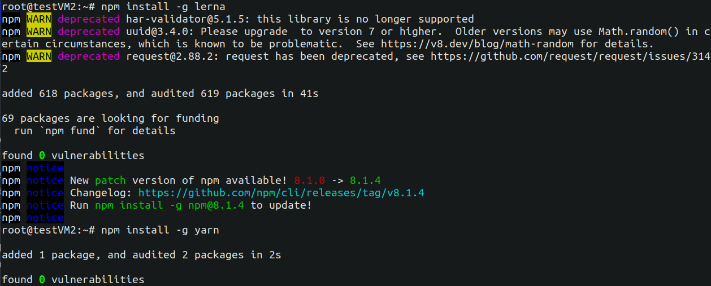

<h1 align="center"><strong>Scramjet Transform Hub</strong></h1>
<p align="center">
    <a href="https://github.com/scramjetorg/transform-hub/blob/HEAD/LICENSE"></a>
    <a href="https://npmjs.org/package/@scramjet/sth"></a>
    <a href="https://github.com/scramjetorg/transform-hub"></a>
    <a href="https://npmjs.org/package/@scramjet/sth"></a>
    <a href="https://scr.je/join-community-mg1"></a>
    <a href="https://www.paypal.com/cgi-bin/webscr?cmd=_s-xclick&hosted_button_id=7F7V65C43EBMW">
        
    </a>
</p>
<p align="center">⭐ Star us on GitHub — it motivates us a lot! 🚀 </p>
<p align="center">
    
</p>

# The Idea <!-- omit in toc -->

Scramjet Transform Hub is a serverless system that allows you to easily deploy, run and interconnect programs that process repetitive data tasks in long-running processes. STH can be run just as well on a Raspberry Pi as it can on a massive 128 core Epyc bare metal server. It installs in one simple command and deploys your app to the cloud just as easily... Oh, and the app is incredibly simple too:

```js
export (input: Readable) => async function*() {
     for (const post of input) {
         if (!cache.has(post.id)) {
             yield await slack.note(`New post titled "${post.title}" from ${post.author}`);
         }
     }
}
```

It currently supports Node.js based apps, but Python and other languages are coming.

[Get Scramjet Transform Hub straight from NPM](https://www.npmjs.com/package/@scramjet/sth)

---

# Table of contents <!-- omit in toc -->

- [Introduction :handshake:](#introduction-handshake)
- [Usage :bulb:](#usage-bulb)
- [The basics :abcd:](#the-basics-abcd)
- [Development instructions :construction_worker:](#development-instructions-construction_worker)
  - [Installation :clamp:](#installation-clamp)
    - [Environment setup](#environment-setup)
    - [STH installation](#sth-installation)
  - [Start STH :checkered_flag:](#start-sth-checkered_flag)
  - [Install CLI and execute :white_check_mark:](#install-cli-and-execute-white_check_mark)
  - [Build the packages :building_construction:](#build-the-packages-building_construction)
  - [Docker commands :whale:](#docker-commands-whale)
  - [Build Hub on Docker :building_construction:](#build-hub-on-docker-building_construction)
  - [Run Transform Hub in Docker :robot:](#run-transform-hub-in-docker-robot)
  - [Lerna commands :pencil:](#lerna-commands-pencil)
  - [Autocomplete :zap:](#autocomplete-zap)
  - [Git branching workflow](#git-branching-workflow)
- [Sample usage :sunglasses:](#sample-usage-sunglasses)
  - ["Hello Alice" sample :wave:](#hello-alice-sample-wave)
  - [More samples :books:](#more-samples-books)
  - [Configure your own sample :pencil:](#configure-your-own-sample-pencil)
- [Troubleshooting :collision:](#troubleshooting-collision)
- [Cloud Platform Beta is coming 🥳](#cloud-platform-beta-is-coming-)
- [License and contributions :page_with_curl:](#license-and-contributions-page_with_curl)
- [Help wanted :information_desk_person:](#help-wanted-information_desk_person)
- [Donation :money_with_wings:](#donation-money_with_wings)

---

# Introduction :handshake:

This is a development repo for Scramjet Transform Hub, a container supervisor that allows deployment, execution and monitoring of any application based on a simple interface.

This repository contains the source code for <https://hub.scramjet.org>.

If you want to read more about the usage please go to [Quick Start](https://github.com/scramjetorg/platform-docs) repo.

You may also be interested in our [Scramjet Cloud Platform](https://docs.scramjet.org/platform) that is based on Transform-Hub.

What's more, this repository is intended for developers who would like to:

- participate in the Scramjet Transform Hub development community
- register feature requests, issues and PRs for this product
- build Transform Hub from source
- dive into code and see how it works

For developers who would like to simply use Scramjet Transform Hub to run data processing applications, we recommend following resources:

 [Repository with Introductory README and templates](https://github.com/scramjetorg/platform-docs)

 [Repository with samples](https://github.com/scramjetorg/platform-samples)

 [NPM page for main scramjet/sth package](https://www.npmjs.com/package/@scramjet/sth)

 [NPM page for scramjet/cli package](https://www.npmjs.com/package/@scramjet/cli)

---

# Usage :bulb:

Scramjet Transform Hub is a deployment and execution platform. Once installed on a server, it will allow you to start your programs and keep them running on a remote machine. You will be able to start programs in the background or connect to them and see their output directly on your terminal. You will be able to pipe your local data to the program as if it was running from your terminal. You can start your server in AWS, Google Cloud or Azure, start it on your local machine, install it on a Raspberry Pi or wherever else you'd like.

There's no limit to what you can use it for. Do you want a stock checker? A chatbot? Maybe you'd like to automate your home? Retrieve sensor data? Maybe you have a lot of data and want to transfer and wrangle it? You have a database of cities and you'd like to enrich your data? You do machine learning and you want to train your set while the data is fetched in real-time? Or perhaps you want to use it for something else and ask us if that's a good use? Ask us [via email](mailto:get@scramjet.org) 📧 or hop on our [Scramjet Discord ](https://scr.je/join-community-mg1) and we'll be happy to talk with you.

[Check our proposition of sample architecture for use cases in different industries.](https://scramjet.org/#use-cases)


---

# The basics :abcd:

**NOTE:** This is the STH development repo and in order to use it, you need to have **Unix/linux** based operating system, for example [Ubuntu](https://ubuntu.com/download/server). We also use [docker](https://www.docker.com/get-started) and [node.js v16.x](https://nodejs.org/en/). We're working on development guides for Mac and Windows. 🔜

Scramjet Transform Hub allows you to deploy and execute programs that you build and develop. As mentioned above, you can run any program you like, but you need to know a couple of important things:

- The program should consist of a function or an array of functions, such a program is called a **Transform Sequence**.
- The Sequence will be executed within a separate docker instance (🔜 we're working on other execution environment integrations - help will be appreciated 🦾).
- The Sequence function will receive a stream as input in the first argument - you can send the data to it via the command `si instance input`.
- If your Sequence contains more than one function, then the output from the first function is passed to the next one. Also, the first function in Sequence receives the input from API.
- The last (or the only) function in Sequence can return a `Promise` or a `Stream` - based on this, STH will know when processing is done.
- Once the returned `Promise` is resolved, or the `Stream` is ended, STH will gracefully stop the Sequence and remove its container.
- You can communicate with the server via API, command line client `si` which we wrote for your convenience.
- The Sequence is called with an AppContext as `this`, a class that allows you to communicate back from the Sequence: send logs, provide health info, send and receive events from the API or CLI.
- You can run your Sequence multiple times with different arguments (like for instance currency tickers with different symbols or sensor data readers for each sensor)
- The program does not leave your server and doesn't use any external systems. It runs on the server you install the host on.
- Currently STH supports node.js runner only, we're working on bringing you runners for other languages, with Python and C++ as the first ones.

Some important links 👀:

- Here you can find the definition of the [Transform Sequence AppContext](./docs/types/interfaces/appcontext.md)
- You can see the [Scramjet Transform Hub API docs here](./docs/interfaces/API-reference.md)
- You can see the [CLI documentation here](./docs/interfaces/CLI-command-reference.md), but `si help` should also be quite effective.
- Don't forget to ⭐ this repo if you like it, `subscribe` to releases and keep visiting us for new versions and updates.
- You can [open an issue - file a bug report or a feature request here](https://github.com/scramjetorg/transform-hub/issues/new/choose)

---

# Development instructions :construction_worker:

This section contains more detailed installation descriptions, it is intended for developers who would like to contribute or build Transform Hub from source. If you wish to fire up STH quickly and without unnecessary installations, go to Quick Start [installation section](https://github.com/scramjetorg/platform-docs#2-installation), which focuses on starting STH and deploying a sample application.

In this section we will also show you some useful commands, tools and functionalities that you can use to develop your own programs.

If you want to help out, we're happy to accept your pull requests. Please follow the below information to start development.

## Installation :clamp:

> **Reminder:** This is a development guide. In order to use it, you need to have a Unix/linux based os (e.g. [Ubuntu](https://ubuntu.com/download/server)), [docker](https://www.docker.com/get-started) and [node.js v16.x](https://nodejs.org/en/) installed. We're working on development guides for Mac and Windows. 🔜

### Environment setup


There are several installations you need to perform to get STH up and running, and even more to start developing with us. You may already have some of these below installed, but we will show you how to install them anyway.

- nvm
- node.js
- lerna
- yarn
- typescript
- ts-node
- docker
- pip

Our hub is based on node.js, so you need to install node.js and npm, which is the default package manager for node.js.
To check if you already have Node.js(v16.xx.x) and npm installed, run the following commands in your console:

```bash
node -v
npm -v
```

If none of the above commands is found, **you must proceed with the installation.**

It is recommended to use a **Node version manager** like [nvm](https://github.com/nvm-sh/nvm/blob/master/README.md) to install Node.js and npm. Do it by running the install script using either of the commands bellow. 
> Note: Make sure you replace v0.39.0 with the latest version of nvm. The actual version of nvm to install is [here](https://github.com/nvm-sh/nvm/blob/master/README.md#install--update-script).

```bash
curl -o- https://raw.githubusercontent.com/nvm-sh/nvm/v0.39.0/install.sh | bash

wget -qO- https://raw.githubusercontent.com/nvm-sh/nvm/v0.39.0/install.sh | bash
```

After executing the above command you should see:


which means that you need to run those two more commands to finish the nvm installation:

```bash
export NVM_DIR="$HOME/.nvm"
[ -s "$NVM_DIR/nvm.sh" ] && \. "$NVM_DIR/nvm.sh"
[ -s "$NVM_DIR/bash_completion" ] && \. "$NVM_DIR/bash_completion"
```

Export lines from above will be saved in your ~/.bashrc file so that you won't need to run it with every session start.


Now you are ready to **install node.js**, simply type in your console:

```bash
nvm install --lts    # command will install latest LTS Version of Node.js
```

> 💡 **Note**:
> The project is working on Node Long Term Support (LTS) Version, which contains Node Package Manager (NPM) in `^8.15.0` version.
> NodeJS in version `^17.XX.X` will install NPM in version `^8.1.2` and we don't use it right now 😉.

🤓 For more info visit the node.js official [webpage](https://nodejs.org).

Now you can check installed versions of node.js and npm, run the following commands in your console:


```bash
$ node -v
v16.13.0

$ npm -v
8.15.0
```

**OK!** It looks like you have successfully installed node.js and npm. 

There are two more installations you need to perform, run the following commands in your console one after another:

```bash
npm install -g lerna   # lerna is a tool that we use for publishing multiple packages to npm.
npm install -g yarn   # yarn is a package manager
```



The same as before the installations can be confirmed by checking the installed versions:

```bash
$ lerna -v
4.0.0

$ yarn -v
1.22.17
```

**OK!** The installation was successful. 🎉 🎆

STH can run python packages, and for that it needs to have `python` and `pip`. These should be already installed on your system - check with:

```bash
python3 --version
pip --version
```

If they are not present, refer to the official installation guide for [Python](https://wiki.python.org/moin/BeginnersGuide/Download) and [Pip](https://pip.pypa.io/en/stable/installation/).

> **If you don't want to use Docker, please skip this step!**

We also work with Docker, but this is optional. Running STH is possible without Docker in the background. If you want to use Docker, you can install it by running the following commands in your console:

```bash
# Install docker and docker-compose
sudo apt install -y docker.io docker-compose

# Verify installations by getting versions
sudo docker version
docker-compose version

# Add you user to the docker group
sudo gpasswd -a $USER docker
```

### STH installation

There are two ways to install STH, either by getting the package from npmjs or by cloning repo.

**First**, let's install current STH from the npm registry -> [@scramjet/sth](https://www.npmjs.com/package/@scramjet/sth):

```bash
npm i -g @scramjet/sth   # installs the package globally
```


When you start STH from npm, no package installations or builds are required. You can start STH right away, with one of those two commands: `scramjet-transform-hub` or `sth`. This was quick, wasn't it?:D


**Second** way is designed for developers who want to contribute and not just use STH.

 Let's clone the transform-hub repo. After that, some more installations will be required. Please copy the following commands to the terminal:

```bash
git clone https://github.com/scramjetorg/transform-hub.git && \
cd transform-hub && \
yarn install && yarn build:all && npm i -g ./dist/cli
```

Depending on your machine this may take some time, so it is a perfect time for another hot beverage ☕ or walk 🚶🏼‍♀️ or joggling 🤹‍♂️ or push-ups maybe..? no? Then simply wait 🧘.

In the meantime let me describe for you what is happening in the command you have just pasted into the console:

- `git clone https://github.com/scramjetorg/transform-hub.git` is cloning STH repository.
- `cd transform-hub` is changing the directory to STH repository.
- `yarn install` is installing all the dependencies of STH.
- `yarn build:all` is building all STH packages, this script includes three other building scripts (yarn build:packages && yarn build:refapps && yarn build:docker).
- `npm i -g ./dist/cli` is installing STH [CLI](https://github.com/scramjetorg/scramjet-cli) as a global command.

When both the package installation and build are complete, STH should be ready to run.

 

---

## Start STH :checkered_flag:

STH can be started in multiple ways. The default way is to run it with Docker and on localhost and port number 8000. Choose one of the following:

If installed by **cloning the repo**:

```bash
yarn start               # Starts Hub after it's been built using script

yarn start:dev           # Starts Hub in development mode
```
If installed as **npm package**:

```bash
scramjet-transform-hub   # Starts Hub from installed npm package (@scramjet/sth)

sth                      # alias for scramjet-transform-hub
```
You can also start STH without Docker, use the same commands as above but add `--no-docker` flag:

```bash
yarn start --no-docker

yarn start:dev --no-docker

sth --no-docker
```

There is a wide range of options that you can start STH with. Please add `--help` or `-h` flag to list all the options:

```bash
yarn start --help

yarn start:dev --help

sth --help
```

```shell
$ sth --help
Usage: sth [options]

Options:
  -L, --log-level <level>         Specify log level (default: "debug")
  -S, --socket-path <socket>      CSI socket location
  -P, --port <port>               API port
  -H, --hostname <IP>             API IP
  -E, --identify-existing         Index existing volumes as sequences (default: false)
  -C, --cpm-url <host:ip>
  --id <id>
  --runner-image <image name>     Image used by runner
  --runner-max-mem <mb>           Maximum mem used by runner
  --prerunner-image <image name>  Image used by prerunner
  --prerunner-max-mem <mb>        Maximum mem used by prerunner
  --expose-host-ip <ip>           Host IP address that the Runner containers port is mapped to.
  --runtime-adapter <type>        Run all the instances on the given type of container or on host machine. Possible value: `process`, `docker`, `kubernetes`. Keep in mind that using `process` is UNSAFE FOR RUNNING ARBITRARY CODE.
  --sequences-root                Only works with --runtime-adapter=process option. Where should ProcessSequenceAdapter save new sequences
  -h, --help                      display help for command
```

## Install CLI and execute :white_check_mark:

CLI installation was already done at the end of the [Installation](#installation-clamp) section, just before starting STH. But it is worth mentioning, that there are two ways to install the CLI:

- from the source code. In the root folder, **after building**, run the commands:

```bash
npm i -g ./dist/cli # install CLI globally from the source folder
si help             # show CLI commands
```

- from [npm](https://www.npmjs.com/package/@scramjet/cli):

```bash
npm i -g @scramjet/cli # install CLI globally from npm
si help                # show CLI commands
```


Running `si help` command will confirm that the installation went properly and also to see the list of available commands:

```bash
$ si --help
Current profile: default
Usage: si [options] [command]

This is a Scramjet Command Line Interface to communicate with Transform Hub and Cloud Platform.

Options:
  -v, --version            Display current CLI version
  --config <name>          Set global configuration profile
  --config-path <path>     Set global configuration from file
  -h, --help               display help for command

Commands:
  hub                      Allows to run programs in different data centers, computers or devices in local network
  config|c                 Config contains default Scramjet Transform Hub (STH) and Scramjet Cloud Platform (SCP) settings
  sequence|seq             Operations on a Sequence package, consisting of one or more functions executed one after another
  instance|inst [command]  Operations on the running Sequence
  topic                    Manage data flow through topics operations
  completion               completion operations
  util|u                   Various utilities

To find out more about CLI, please check out our docs at https://hub.scramjet.org/docs/cli

Read more about Scramjet at https://scramjet.org/ 🚀
```

You can also run CLI commands from the source code using `yarn start:dev:cli` instead of `si`, in this case no installation is needed, eg.:

```bash
$ yarn start:dev:cli --version
yarn run v1.22.17

$ ts-node packages/cli/src/bin/index.ts --version
CLI version: 0.28.1
```

We will use CLI later on to execute the Sequence. If you would like to read more about our command line interface jump right away to [CLI docs](https://github.com/scramjetorg/transform-hub/blob/main/docs/cli) in this repo or explore [CLI Reference](https://docs.scramjet.org/platform/cli-reference) section on our official website [www.scramjet.org](https://scramjet.org/).

## Build the packages :building_construction:

All the packages in the project need to be installed and built before they can be used.

**Install** will create a `node_modules` folder in the root of the project and in each package (dependencies will be installed).

**Build** will create a `dist` folder in the root of the project and in each package. The folder will contain the files with the code compiled into JavaScript.

This is how to perform a clean install and build of all the packages:

```bash
yarn install:clean    # this command will perform 'yarn clean && yarn clean:modules && yarn install' at once
yarn build:packages   # optionally 'build:all' if you want all dockerfiles.
```


> 💡 **HINT:** For more scripts please see `"scripts: {}"` in main [package.json](package.json#scripts).

## Docker commands :whale:

During development, some artifacts may be leftover in docker. See how to clean them:

```bash
docker ps                      # list containers
docker volume prune -f         # remove all unused local volumes
docker system prune --all -f   # remove all unused images not just dangling ones
docker stop $(docker ps -a -q) # stops all running containers
```

> **\*(`-f`)** - doesn't prompt confirmation

## Build Hub on Docker :building_construction:

Build from current source:

```bash
cd ./packages/sth/
yarn build:docker
```

## Run Transform Hub in Docker :robot:

```bash
cd ./packages/sth/
docker-compose up

# or run in detached mode
docker-compose up -d
docker-compose logs -f
```

To run Hub without docker-compose:

```bash
docker run \
  -ti  \
  --name scramjet-hub \
  --init \
  -p 8000:8000 \
  -v /tmp/:/tmp/ \
  -v /var/run/docker.sock:/var/run/docker.sock \
  scramjetorg/sth:$(jq -r .version package.json)
```

## Lerna commands :pencil:

We use Lerna to control our monorepo. Here's a couple of helpful commands, which might be useful during development:

```bash
lerna create package_name # Add new package:
lerna ls                  # List all of the public packages in the current Lerna repo:
lerna run [script]        # Run an npm script in each package that contains that script.
lerna run --ignore @scramjet/<package_name> <script-name>
    # Run script in all packages excluding one package:
lerna run --ignore @scramjet/<package_name> --ignore @scramjet/<package_name> <script-name>
    # ... or run script excluding more packages
lerna run --scope @scramjet/<package_name> <script-name>
    # Run script only in one package
lerna run --scope @scramjet/<package_name> --scope @scramjet/<package_name> <script-name>
    # Run script in more packages
```

## Autocomplete :zap:

Completion script depends on bash-completion so make sure it's already installed by running `type _init_completion`.

Below command installs completion script in ~/.bashrc.

```bash
si completion install
```

For immediate effect make sure to run `source ~/.bashrc`. Also you can manage completion script by yourself. Running `si completion bash` prints script to the terminal.

---

## Git branching workflow

There are two important branches: `main` (representing stable version of the
project) and `devel` (where most of the work happens; this is the default
branch).

- New features, and especially breaking changes, should go to the `devel` branch.
- Bugfixes, especially ones that should be published in a bugfix release,
  should be merged into the `main` branch.
  - Start such bugfix branches from `main`, and make PRs to `main`.
  - After a bugfix is merged, `main` should be merged into `devel` to get the
    bugfix there as well.

The purpose of having two branches is to keep important bugfixes separate from
new features, so that a bugfix version (a release without new features, just
bugfixes) can be published immediately if needed.

# Sample usage :sunglasses:

## "Hello World!" sample :wave:

Further actions will work only if you have properly configured your environment, installed hub and built all the packages.
By this time you should already have all those things done by going through the [Installation](#installation-clamp) section.

> 💡 **HINT:** _The following instructions apply to the state of the repository from the `release/0.28.0`._

- Run STH:
```bash
yarn start      # if cloned STH repo

sth             # if installed STH as npm package
```
Open a new terminal window **inside transform-hub root** folder and do the following:

- Send the hello-world Sequence package to the STH and start it:
```bash
si seq send packages/hello-world.tar.gz

si seq start -      # '-' means last uploaded Sequence
si seq start <id>   # or you can specify id parameter instead
```

Alternatively, you can use ***deploy*** which does 3in1 - it packs (if neccessary), sends and starts the Sequence:

```bash
si seq deploy packages/hello-world.tar.gz
```
You should see on the STH terminal that it received the Sequence.

**Let's connect to the output stream.** Run this command:
```bash
si inst output -        # '-' means last uploaded Sequence
si inst output <id>     # or you can specify id parameter instead
```
Note that we need an instance ID, not the Sequence.
If the output from previous command have been cleared on your terminal, you can still list all your Sequences and instances by running the following:
- **List Sequences:**
```bash
si seq list
```
- **List instances:**
```bash
si inst list
```
After using instance's ID with `si inst output` command, you should see **"Hello World!"** on your terminal window.

[See more about streams and curl commands =>](docs/read-more/stream-and-api.md)

## More samples :books:

To check out more of our ready-to-go samples, please go to our [Samples repo](https://github.com/scramjetorg/platform-samples) on GitHub, or to our [Samples Hub](https://docs.scramjet.org/platform/samples).

## Configure your own sample :pencil:

We have also prepared a template for you to use. You can use it as a base for your own samples 👉 [sample template](https://github.com/scramjetorg/platform-docs/tree/main/templates). For this moment we support two variants of template in two programming languages:

- JavaScript (Node.js) 👉 [template](https://github.com/scramjetorg/platform-docs/tree/main/templates/template-js)
- TypeScript (ts-node) 👉 [template](https://github.com/scramjetorg/platform-docs/tree/main/templates/template-ts)
- Python 👉 [template](https://github.com/scramjetorg/platform-docs/tree/main/templates/template-ts)

There is also C++ template that is still in development stage:

# Troubleshooting :collision:

### **Docker issues:** <!-- omit in toc -->

<details>
<summary>
    <strong>Error: connect ENOENT /var/run/docker.sock</strong>
</summary>

During sending the Sequence compressed package to the host you may come across this error:

- **_Error: connect ENOENT /var/run/docker.sock_**

    ```bash
    2022-01-13T11:54:26.948Z info (object:Host) New sequence incoming...
    2022-01-13T11:54:26.948Z log (object:DockerSequenceAdapter) DockerSequenceAdapter init.
    2022-01-13T11:54:26.948Z log (object:DockerodeDockerHelper) Checking image scramjetorg/pre-runner:0.14.0
    2022-01-13T11:54:26.949Z log (object:DockerodeDockerHelper) Start pulling image scramjetorg/pre-runner:0.14.0
    2022-01-13T11:54:26.949Z debug (object:Host) Error: connect ENOENT /var/run/docker.sock
        at PipeConnectWrap.afterConnect [as oncomplete] (node:net:1161:16)
    2022-01-13T11:54:26.950Z debug (object:Host) Request date: 2022-01-13T11:54:26.948Z, method: POST, url: /api/v1/sequence, status: 422
    ```

To solve this issue you need to install docker and docker-compose. You can install them using the following command below or refer to [official Docker instructions](https://docs.docker.com/get-docker/).

    ```bash
    sudo apt install -y docker.io docker-compose
    ```

</details>

<details>
<summary>
    <strong>Error: connect EACCES /var/run/docker.sock</strong>
</summary>

During sending the Sequence compressed package to the host you may come across this error:

- **_Error: connect EACCES /var/run/docker.sock_**

    ```bash
    2022-01-13T11:58:00.368Z info (object:Host) New sequence incoming...
    2022-01-13T11:58:00.369Z log (object:DockerSequenceAdapter) DockerSequenceAdapter init.
    2022-01-13T11:58:00.370Z log (object:DockerodeDockerHelper) Checking image scramjetorg/pre-runner:0.14.0
    2022-01-13T11:58:00.375Z log (object:DockerodeDockerHelper) Start pulling image scramjetorg/pre-runner:0.14.0
    2022-01-13T11:58:00.377Z debug (object:Host) Error: connect EACCES /var/run/docker.sock
        at PipeConnectWrap.afterConnect [as oncomplete] (node:net:1161:16)
    2022-01-13T11:58:00.379Z debug (object:Host) Request date: 2022-01-13T11:58:00.373Z, method: POST, url: /api/v1/sequence, status: 422
    ```

To solve this issue you need to add the current user to the docker group, please use this command:

```bash
sudo gpasswd -a $USER docker
```
If the problem persists, restart your PC.
</details><br>

### **Packages issues:** <!-- omit in toc -->

<details>
<summary>
    <strong>Errors related to build packages</strong>
</summary><br>

If something goes wrong during building packages, any errors occur, please try to run clean build, which will remove all `node_modules` and `dist` directories, after that you try to install and build them again.

```bash
yarn clean && yarn clean:modules && yarn install && yarn build:all
```

</details>

<details>
<summary>
    <strong>Errors related to reference-apps package</strong>
</summary><br>

Every reference-app package before we run it, needs to:

- have `node_modules` installed (`yarn install`)
- have `dist` directory created and tar.gz package created (`yarn build:refapps`)

Remember to install dependencies and build your sample package before compressing it.

If you create your sample in `packages/reference-apps` folder, you can use the following command to build it:

```bash
yarn build:refapps
```

It will build all the packages in the `packages/reference-apps` folder.

</details><br>

> **💡 HINT:** Have a look at the root `package.json`, there is the `scripts` section, which contains the list of all the scripts you can run with lerna. You may find them useful.

Log an issue/bug every time you encounter a problem or find a bug. Maybe you will also find that some feature is missing?

- [bug report](https://github.com/scramjetorg/transform-hub/issues/new?assignees=&labels=&template=bug_report.md&title=)
- [feature request](https://github.com/scramjetorg/transform-hub/issues/new?assignees=&labels=&template=feature_request.md&title=)

---

# Cloud Platform Beta is coming 🥳

[](https://scramjet.org/#join-beta)

---

# License and contributions :page_with_curl:

This project is dual licensed under the AGPL-3.0 and MIT licenses. Parts of the project that are linked with your programs are MIT licensed, the rest is AGPL.

We accept valid contributions and we will be publishing a more specific project road map so contributors can propose features and also help us implement them. We kindly ask you that contributed commits are Signed-Off `git commit --sign-off`.

We provide support for contributions via test cases. If you expect a certain type of workflow to be officially supported, please specify and implement a test case in `Gherkin` format in [`bdd` directory](./bdd).

More info about bdd tests can be found [here](./bdd/README.md).

---

# Help wanted :information_desk_person:

The project need's your help! There's lots of work to do and we have a lot of plans. If you want to help and be part of the Scramjet team, please reach out to us, [on discord](https://scr.je/join-community-mg1) or email us: [opensource@scramjet.org](opensource@scramjet.org).

---

# Donation :money_with_wings:

Do you like this project? It helped you to reduce time spent on delivering your solution? You are welcome to buy us a coffee ☕

- [You can sponsor us on github](https://github.com/sponsors/scramjetorg)

- There's also a Paypal donation link if you prefer that:

[](https://www.paypal.com/cgi-bin/webscr?cmd=_s-xclick&hosted_button_id=7F7V65C43EBMW)
