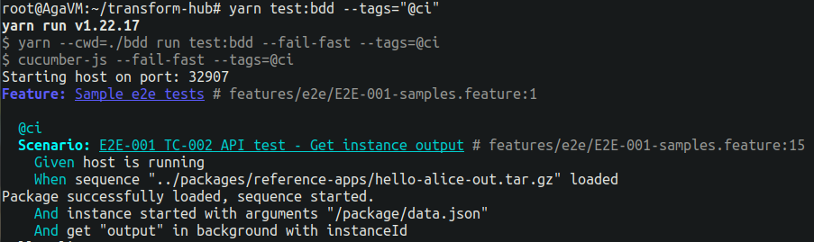

# Behaviour Driven Development

As the "problem scope" of the business problem that our technology solves is quite complex, we decided to use the BDD practice to support the development process. BDD is a methodology of high automation and agility. It describes a cycle of interactions with well-defined outcomes. As a result of these activities, we obtain working, tested software that has real value.

We use [Cucumber](https://cucumber.io/) as a software tool to support the BDD process and [Gherkin](https://cucumber.io/docs/gherkin/) syntax that allows us to write tests in a human-readable language.

If you use Visual Studio Code as your IDE, please install the [Cucumber (Gherkin) Full Support](https://marketplace.visualstudio.com/items?itemName=alexkrechik.cucumberautocomplete&ssr=false#review-details) extension. It will be very useful for writing or editing BDD tests. After installing it, please make sure that in your local .vscode/ directory file `settings.json` exists:

```json
{
  "cucumberautocomplete.steps": [
    "./bdd/step-definitions/**/*.ts"
  ],
  "cucumberautocomplete.strictGherkinCompletion": true
}

```

---

# How to run tests :runner:

## How to run BDD tests :cucumber:

The following instructions apply to the state of the repository from `release/0.22`.

BDD tests are located in a `bdd` folder, to execute them simply follow the steps below.

### Preparation :books:

Before start running any test, please make sure that all the packages are installed and built. In order to do that please run the following command:

```bash
yarn clean && yarn install && yarn build:all
```

This command will remove all the `'dist'` folders (if there were any), after that it will install dependencies, and compile the code in all the packages including `'reference-apps'` package, which contains all the Sequences that we use in our BDD tests. After executing the command from above, every Sequence will be also compressed into `.tar.gz` file. Those compressed files are ready-to-use Sequence packages, that we use in BDD test scenarios.

### Executing BDD tests :rocket:

The test scenarios are located in `*.feature` files, and these are in separate folders named according to the subject of the testing, and these in `features` directory in `bdd` folder.
Every scenario has its title and unique index number. We can use those indexes to either execute one test or bulk of tests, for example:

- to execute one particular test named `Scenario: E2E-001 TC-002 API test - Get instance output` run the following command:

> :bulb: **NOTE:** Commands for executing tests must be run from the root of the repository.

```bash
yarn test:bdd --name="E2E-001 TC-002"
```

This is the output after running this single test:


- to execute a bulk of scenarios, for example from the same feature file, you can simply use the substring of their index like "E2E-001", and run the following command:

```bash
yarn test:bdd --name="E2E-001"
```

This command will run all the scenarios that have the substring "E2E-001" in their index, whether they are in the same feature file or not. Cucumber will search all the files.

Three tests scenarios were found and executed:


When you want to execute a group of tests you can do it using the substring of their name, for example, to execute all E2E tests:

```bash
yarn test:BDD --name="E2E"
```

- you can also execute a bulk of tests by using their `--tag` (`@tag_name`). Tags are used to group related features, independent of your file and directory structure. For example:

```bash
yarn test:bdd --tags="@ci"
```

The list of scenarios marked with `@ci` tag is quite long so I will paste only the start of the test and the summary of the test execution:



(...)


A scenario can have more thatn one tag, can have two or even more, for example:


In the situation like this above, when you want to execute tests with `@ci` tag but without `@starts-host` tag, a command like this below will do the job:

```bash
yarn test:bdd --tags="@ci" --tags="not @starts-host"
```

### Results :bar_chart:

The results of the performed test will be displayed in the console as a summary of executed tests. There is also a report generated in `html` which illustrates the results in a very user-friendly form. Html report is generated every time we run a BDD test, those html's are saved in `bdd/reports` folder.

## Shell variables :shell: :computer:

There is a list of variables that can be used in BDD tests. These variables are used to pass values to the test scenarios. The full list of variables you will find here :point_right: [ENV_VARS.md](../ENV_VARS.md)

You can use them in the command line, for example like this:

```bash
DEVELOPMENT=1 yarn test:bdd --name="E2E-001 TC-002"
# it will run the tests in development mode, which means that logs will be seen during test execution.
```

# How to run unit tests :runner:

With the command below you will run all the unit tests in a whole project:

    yarn test

This command runs `test` script defined in the main `package.json` [file](../package.json). In result, the script goes through all the packages and runs unit tests in every package.

If you see the error along the way, that means some tests were not passed.

Below you can see an example, which shows the result of all passed unit tests in all the packages:

```bash
yarn test
# yarn run v1.22.19
# yarn test:packages
# $scripts/run-script.js test
# run-script: 3.791s packages/client-utils: script test executed in 3775ms.
# run-script: 4.059s packages/adapters: script test executed in 4044ms.
# run-script: 4.518s packages/api-client: script test executed in 4502ms.
# run-script: 6.072s packages/cli: script test executed in 6056ms.
# run-script: 6.991s packages/host: script test executed in 6976ms.
# run-script: 7.343s packages/api-server: script test executed in 7327ms.
# run-script: 8.332s packages/load-check: script test executed in 4272ms.
# run-script: 8.659s packages/obj-logger: script test executed in 327ms.
# run-script: 8.772s packages/logger: script test executed in 4253ms.
# run-script: 8.780s packages/pre-runner: script test executed in 8ms.
# run-script: 9.570s packages/manager-api-client: script test executed in 2227ms.
# run-script: 9.600s packages/middleware-api-client: script test executed in 2256ms.
# run-script: 9.609s packages/multi-manager-api-client: script test executed in 2265ms.
# run-script: 11.378s packages/model: script test executed in 4034ms.
# run-script: 11.408s packages/telemetry: script test executed in 30ms.
# run-script: 11.409s packages/sth: script test executed in 30ms.
# run-script: 14.450s packages/sth-config: script test executed in 3071ms.
# run-script: 14.450s packages/symbols: script test executed in 3071ms.
# run-script: 14.743s packages/utility: script test failed with code=1!
# packages/utility: command was: "npm run test:ava"
#
# > @scramjet/utility@0.31.2 test:ava
# > ava
#
#
#   ✔ host › merge() should overwrite primitive values
#   ✔ host › merge() should deeply merge object values
#   ✔ host › merge() objFrom argument type should only allow deep partial
#   ✖ configFileDefault › Default file returned on invalid file path Error thrown in test
#   ✔ configFileDefault › Default config returned on invalid config in file
#   ✔ configFileDefault › Config returned on valid config in file
#   ✔ configFileDefault › Restore default configuration
#   ─
#
#   configFileDefault › Default file returned on invalid file path
#
#   test/configFileDefault.spec.ts:26
#
#    25:     constructor(path: string) {
#    26:         super(path, testDefaultConfig);
#    27:     }
#
#   Error thrown in test:
#
#   Error {
#     code: 'ENOENT',
#     errno: -2,
#     syscall: 'open',
#     message: 'ENOENT: no such file or directory, open',
#   }
#
#   › TextFile.write (src/file/textFile.ts:12:45)
#   › TextFile.create (src/file/textFile.ts:34:14)
#   › TestConfigFileDefault.createIfNotExistAndWrite (src/config/configFile.ts:34:45)
#   › TestConfigFileDefault.set (src/config/configFile.ts:42:21)
#   › new ConfigFile (src/config/configFile.ts:20:14)
#   › new ConfigFileDefault (src/config/configFileDefault.ts:11:9)
#   › new TestConfigFileDefault (test/configFileDefault.spec.ts:26:9)
#   › test/configFileDefault.spec.ts:83:24
#
#   ─
#
#   1 test failed
#
# npm ERR! Lifecycle script `test:ava` failed with error:
# npm ERR! Error: command failed
# npm ERR!   in workspace: @scramjet/utility@0.31.2
# npm ERR!   at location: /home/mczapracki/src/scramjetorg/transform-hub/packages/utility
#
# run-script: 15.340s packages/types: script test executed in 3961ms.
# run-script: 15.740s packages/verser: script test executed in 4330ms.
# Done in 16.19s.
```

If you want to run a particular test file, go to the directory where the test file is and run this command:

    npx ava

For example, if you want to run unit tests for the Runner package, go to runner's test directory and run the test:

    cd packages/runner/test
    npx ava

and you will see the results in the console:


If you want to run one particular test in the file, go to the directory where the test file is and run this command:

    npx ava name-of-the-file.spec.ts -m "Name-of-the-unit-test"

for example:

    npx ava runner.spec.ts -m "Runner new instance"


If you add `-w` a the end of the command above the test will run automatically after every change you make in the test, e.g.:

    npx ava runner.spec.ts -m "Stop sequence" -w
