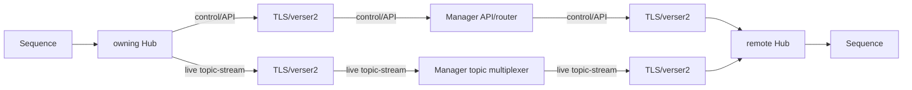

# Manager overview

The **Manager** is the connected-Hub control plane in Transform Hub. It maintains the registry of connected Hubs, routes lifecycle and API operations to the owning Hub, aggregates status, and exposes live topic/service discovery across the connected Hub set. It does not replace the Hub runtime: Sequences still execute in Runners owned by individual Hubs.

## Key responsibilities

- **Command routing** — receives deployment, stop, inspect, and monitoring commands and forwards them to the correct Hub via the verser2 transport protocol.
- **Hub registry** — maintains a registry of connected Hubs and their current connection, health, and inventory status.
- **Instance tracking** — tracks all running Sequence Instances across the fleet, providing a global view.
- **Aggregation readiness** — exposes deterministic v2 health details that show whether connected Hubs have reported sequence and instance inventory.
- **API surface** — exposes the primary REST API that the [CLI](../cli/usage.md) and [API client](../api/client-usage.md) target.

## Manager vs Hub

| Aspect | Hub | Manager |
|--------|-----|---------|
| Role | Executes Sequences | Orchestrates Hubs |
| Scope | Single host | Multi-host fleet |
| API | Direct Hub control | Unified control plane |
| State | Instance state per host | Connected-Hub and instance registry view |

For single-Hub development scenarios, you can interact with the Hub directly. When multiple Hubs are connected, the Manager provides the shared control-plane API and routes each operation to its owning Hub.

## Control-plane and live topic paths

The Manager brokers control/API traffic and live topic/service-discovery streams through connected Hubs:

The Manager API/router control path and the Manager topic multiplexer live-stream path are separate concerns. Topic streams are transient: they are not persisted and cannot be replayed. This model does not provide direct Sequence-to-Sequence networking; Sequences communicate through Hub topics and the Manager-brokered connection when the Hubs are connected. It also makes no HA, failover, or automatic Hub-redirection guarantee.

## Health and readiness

The Manager exposes canonical health data at `GET /api/v2/health`. The health details include an aggregation readiness summary with connected Hub counts, active Hub counts, aggregate sequence and instance counts, and per-Hub inventory readiness. Operators can poll this signal to wait until Manager aggregation has consumed Hub inventory updates.

Legacy `GET /api/v1/health` remains available for backwards-compatible callers.

## MultiManager

**MultiManager** coordinates multiple Manager processes and their API/control-plane lifecycle. Its presence does not by itself imply HA, failover, persistence, or automatic redirection; those behaviors require separate verified deployment behavior and configuration.

## Next steps

- [Running the Manager](running.md) — start and configure the Manager.
- [Connecting Hubs](connecting-hubs.md) — register Hubs with the Manager.
- [Transform Hub core concepts](../transform-hub/core-concepts.md) for background on Hub and Manager architecture.
- [CLI usage patterns](../cli/usage.md) for interacting with the Manager from the command line.
- [Enterprise offerings](../enterprise/overview.md) — RBAC, token authorization, large-scale MultiManager, and multi-organization capabilities.
