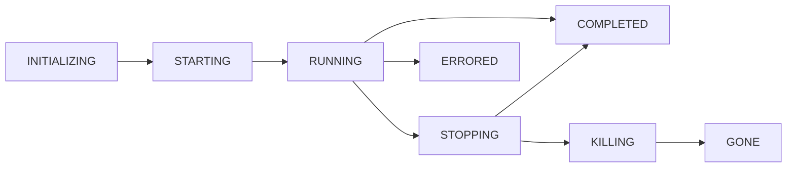

# Sequence lifecycle, input/output streams, and content types

## Lifecycle states

A sequence instance progresses through these states, as defined in `InstanceStatus` from `@scramjet/symbols`:



| State | Description |
|-------|-------------|
| `INITIALIZING` | Instance record created, setup in progress |
| `STARTING` | The outer runner (`start-runner.ts`) is launching the child runtime |
| `RUNNING` | The sequence function is executing; input/output streams are active |
| `STOPPING` | Graceful stop requested via control channel; stop handlers run |
| `KILLING` | Hard kill initiated because stop timed out or was explicit |
| `COMPLETED` | Sequence finished normally |
| `ERRORED` | Sequence terminated with an error |
| `GONE` | Instance is no longer present on the Hub |

## Stream architecture

Each sequence instance communicates with the host through a set of communication channels defined in the `CommunicationChannel` enum from `@scramjet/symbols`.

### Primary channels

| Channel | ID | Direction | Purpose |
|---------|----|-----------|---------|
| `STDIN` | 0 | host → child | Sequence input data |
| `STDOUT` | 1 | child → host | Sequence output data |
| `STDERR` | 2 | child → host | Error/debug output |
| `CONTROL` | 3 | bidirectional | Lifecycle commands and acknowledgements |
| `MONITORING` | 4 | bidirectional | Monitoring frames and control responses |
| `IN` | 5 | host → child | Structured input data |
| `OUT` | 6 | child → host | Structured output data |
| `LOG` | 7 | child → host | Structured log output |
| `REQUESTS` | 8 | bidirectional | HTTP-style request/response for API-exposed sequences |

The outer runner writes a **boot config** JSON file before spawning the child. The child runtime reads this config to learn how to connect its channels.

### Boot config format

```json
{
  "sequencePath": "/path/to/sequence.js",
  "instanceId": "uuid",
  "instancesServerPort": 12345,
  "instancesServerHost": "127.0.0.1",
  "sequenceInfo": { "id": "seq-1", "config": { "engines": { "node": ">=16" } } },
  "sequenceArgs": ["--flag", "value"],
  "appConfig": { "key": "value" },
  "instanceName": "my-instance",
  "logLevel": "DEBUG",
  "exposePath": "/api",
  "exposeHost": "0.0.0.0"
}
```

## Message protocol

All control and monitoring frames use the same wire format: a JSON array `[code, data]` encoded as bytes and terminated by `\r\n`. The frame codes are defined in `RunnerMessageCode` from `@scramjet/symbols`.

### Upstream frames (runner → host)

| Code | Name | Direction | Payload |
|------|------|-----------|---------|
| 3000 | `PING` | monitoring | PID, appConfig, args, expose info |
| 3001 | `MONITORING` | monitoring | Health data (healthy, load, memory, etc.) |
| 3002 | `DESCRIBE_SEQUENCE` | monitoring | Auto-detected function definition |
| 3003 | `ERROR` | monitoring | Serialized error |
| 3006 | `SEQUENCE_STOPPED` | monitoring | Exit reason / error |
| 3010 | `ALIVE` | monitoring | Keep-alive heartbeat |
| 3011 | `SEQUENCE_COMPLETED` | monitoring | Normal completion marker |
| 3012 | `PANG` | monitoring | Output content type metadata |

### Downstream frames (host → runner)

| Code | Name | Direction | Payload |
|------|------|-----------|---------|
| 4000 | `PONG` | control | Acknowledgement of PING |
| 4001 | `STOP` | control | Graceful stop request |
| 4002 | `KILL` | control | Hard kill request |
| 4003 | `MONITORING_RATE` | control | Set monitoring interval |
| 4005 | `SET` | control | Set configuration value |

## Content types

Sequences declare their input and output content types. The runner uses content type information for serialization decisions:

- **`application/x-ndjson`** (default): Newline-delimited JSON — each output item is serialized as a JSON line
- **`application/octet-stream`**: Raw binary passthrough
- **`text/plain`**: Plain text — each item is stringified and joined with newlines
- Any valid MIME type supported by the scramjet stream framework

Content type can be specified in the sequence metadata or via the `AppContext` config.

## Function chaining

When a sequence exports an array of functions, each function's return value becomes the next function's input:

```typescript
export default [
  // parse input
  async function (this: AppContext, input: Readable) {
    return input.pipe(through2.obj((chunk, _, cb) => cb(null, JSON.parse(chunk.toString()))));
  },
  // transform
  async function (this: AppContext, input: Readable) {
    const results = [];
    for await (const obj of input) results.push(transform(obj));
    return results;
  },
];
```

If a function returns a stream, it is piped as-is. If it returns a non-stream value, the runtime wraps it appropriately. The last function's return value is serialized to the output channel.

## Exit codes

The runner maps process exit codes to sequence outcomes via `RunnerExitCode` (from `@scramjet/symbols`):

| Code | Meaning |
|------|---------|
| 0 | Normal completion |
| 20 | Invalid environment variables |
| 21 | Invalid sequence path |
| 22 | Sequence failed on start |
| 23 | Sequence failed during execution |
| 137 | Killed (SIGKILL) |
| 138 | Stopped (SIGTERM) |
| 139 | Disconnected |
| 223 | Cleanup failed |
| 101 | Uncaught exception |
