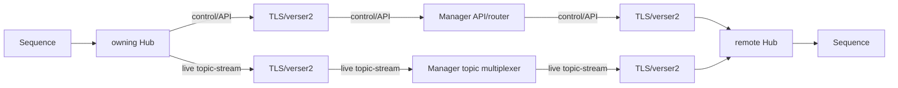

<!-- Generated by scripts/docs.js from docs-source/manager/connecting-hubs.md. Do not edit this file directly. -->


# Connecting Hubs to a Manager

> **⚠️ Needs review**: This page documents the v1-era CPM/HTTP registration flow. TLS/mTLS configuration and verser2 enrollment details are incomplete. For production deployments, consult the Manager configuration schema and generated reference for the authoritative up-to-date connection parameters.

A Hub connects to a Manager so the Manager can route lifecycle/API commands, aggregate status, and broker live topic/service-discovery streams. This page covers Hub registration and connection management.

## Connection topology

The Hub-to-Manager connection uses the **verser2** transport protocol. The communication path is:



The Hub's local verser2 host carries the Manager connection; a Runner does not connect directly to the Manager. The Manager API/router control path is separate from the Manager topic multiplexer live-stream path shown above. Topic streams are not persisted or replayable, and the Manager does not establish direct Sequence-to-Sequence network connections.

In production, verser2 connectivity requires TLS. mTLS is configurable for mutual authentication. See the [Transform Hub configuration](../transform-hub/configuration.md) for verser2-related settings and the generated curated reference for exact type definitions.

## Controlled CSR enrollment

CSR enrollment is disabled by default. Enable it only for a controlled deployment with a private CA key, a private grant directory, and a non-default local operator approval. The Manager validates the CA/key pair and refuses Hub registration unless the presented client-certificate fingerprint is persisted as authorized. Revoking that fingerprint blocks subsequent registrations.

Bearer grants are sent only in the HTTPS `Authorization: Bearer ...` header; never put a grant in the JSON request body or logs. The Hub must pin the Manager CA fingerprint and verify the complete certificate constraints before atomically installing the certificate. Protect the local operator approval and CA key as secrets, and disable enrollment after issuing the required identities.

See [Controlled CSR enrollment](csr-enrollment.md) for the complete API, configuration, trust, recovery, rotation, and limitation details.

## Legacy automatic registration

The v1-era CPM registration flow requires both a CPM identifier and the CPM/Manager URL:

```bash
sth --cpm-id production-node-1 \
  --cpm-url http://manager-host:8200 \
  --verser2-host-url https://manager-host:2443
```

The Hub sends a registration request on startup and uses the verser2 host URL for transport connectivity. This remains available for backwards compatibility, but production setups must also configure TLS trust and, where required, client certificates for mTLS.

## Manual registration

If a Hub is already running, use the Manager API route documented by the active Manager version. This page intentionally avoids a hard-coded manual registration route until the v1/v2 Manager route documentation is generated from source.

## Managing registered Hubs

List all registered Hubs:

```bash
si hub list
```

View a Hub's status and load:

```bash
si hub info
```

Remove a Hub from the Manager:

```bash
si hub delete <hub-id>
```

## Hub identity

Each Hub should have a stable Hub identifier for operations and, when using legacy CPM registration, a CPM registration identifier:

```bash
sth --id production-hub-1 \
  --cpm-id production-node-1 \
  --cpm-url http://manager:8200 \
  --verser2-host-url https://manager:2443
```

If no Hub ID is provided, the Hub generates a random one. Using explicit IDs makes it easier to identify Hubs in the Manager's registry.

## Connection lifecycle

1. **Registration** — the Hub announces itself to the Manager with its capabilities and address.
2. **Heartbeat** — the Hub sends periodic heartbeat signals. The Manager marks a Hub as unhealthy if heartbeats stop.
3. **Command routing** — the Manager forwards deployment and control commands to the Hub.
4. **Deregistration** — when the Hub shuts down gracefully, it deregisters from the Manager. If a Hub disconnects unexpectedly, the Manager marks it as offline.

## MultiManager considerations

In a [MultiManager](overview.md#multimanager) setup, Hubs should be configured with the Manager/MultiManager connection endpoint and TLS policy:

```bash
sth --cpm-id production-node-1 \
  --cpm-url http://manager-a:8200 \
  --verser2-host-url https://manager-a:2443
```

Enrollment and lifecycle behavior depends on the deployed Manager/MultiManager configuration and should be reviewed with the generated config schema and verser2 settings. This documentation makes no automatic Hub-redirection, HA, or failover claim.

## Next steps

- [Run Sequences](../transform-hub/build-run.md) through the Manager.
- Use the [CLI](../cli/usage.md) to manage Hub connections.
- Review [deployment adapters](../deployment/process-adapter.md) for Hub runtime configuration.
